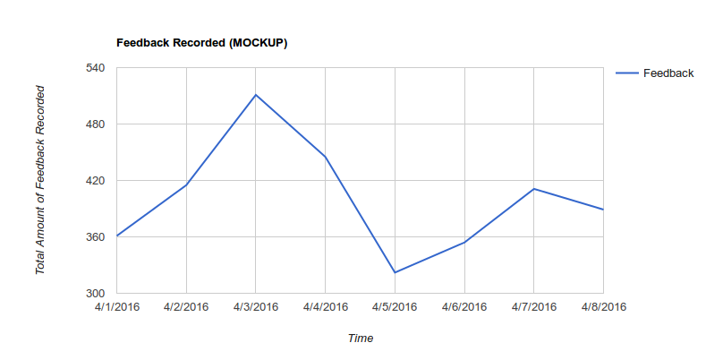
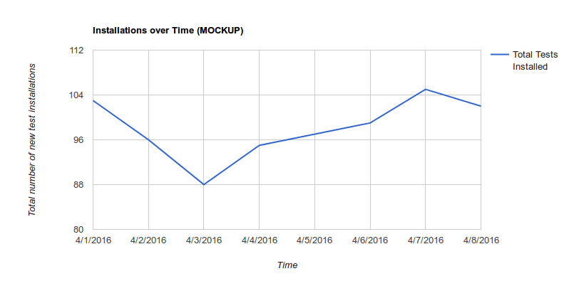

2016 Test Pilot KPIs
====================

*This document is about metrics about Test Pilot, not metrics about
tests within Test Pilot.  If you're looking for more information about
measuring tests themselves please [read the wiki][1].*

# Overview

In 2016, Test Pilot's success will be defined by building a community which
actively participates in testing ideas in Firefox.  Key metrics are documented
below, however other metrics are recorded and analyzed.

## Engagement Ratio

As of this writing, Mozilla has not settled on a final formula for calculating
an Engagement Ratio, so we'll calculate our ratio based off of [what is
currently being discussed][2] and change it in the future if needed.  Quoting
from that discussion:

> Definition of DAU(day): calculate the total number of active users for that
> date using main_ping.subsessiondate == `day`. Because of data lag, this
> calculation will not be final until 10 days after `day`.
>
> Definition of MAU(day): calculate the total number of active users over a
> 28-day window `day` - 28 < main_ping.subsessiondate <= `day.
>
> On the final dashboard, for each date `E`, display the following calculation:
> `MEAN(DAU(d) for E - 7 < d <= E) / MAU(E)`

A daily active user will be defined as any user, using their browser that day,
with at least one test currently enabled in their browser.  This means only
having the Test Pilot extension installed will *not* count as an active user.


## Engagement Breakdown

Within the above Engagement Ratio of a user having at least one test enabled,
it is interesting to see how many users have how many tests enabled, including
the negative space of users with Test Pilot installed but with no tests
enabled.

Total Users here is defined as a Participating User: a user with the Test Pilot
add-on installed and has run Firefox that day.  They may or may not have any
tests enabled.

Below is a mockup of what that could look like.


## Service Health

Test Pilot has two critical functions:  firstly to be the broker enabling and
disabling tests, and secondly, to collect user feedback.  Our main system
health measures will be the number of tests installed over time and the count
of user feedback recorded over time.  These will allow us to quickly see
disruptions in service regardless of cause.




# Data Collection Details

There are two sources for metrics data - the server and the client.

**The server** will use server logs to store metric data which will be picked
up by the measurement team ([some docs][3]), parsed and transformed if
necessary, and pushed into ElasticSearch (as scale permits), S3, and Redshift.
Events recorded in the logs will include:

* request.summary (a generic event fired for each visit)
* testpilot.newuser
* testpilot.newfeedback
* testpilot.main-install
* testpilot.test-install

Data recorded by the log files will include standard system logging (in the
example below, this is everything down to the blank line in the Fields object)
as well as:
* Feature Switch Set (if applicable)
* Campaign (marketing identifier) (if applicable)

Using the [standard format][4] an example object will look like:

```js
{
  "Timestamp": 1457462527,
  "Type": "testpilot.test-install",
  "Logger": "TestPilotWeb",
  "Hostname": "testpilot.servers.s3",
  "EnvVersion": "2.0",  // We're conforming to the Fields spec
  "Severity": 0,
  "Pid": 1000,
  "Fields":{
    "agent": "User Agent String",
    "path": "/tests/",
    "method": "GET",
    "code": 200,
    "errno": 0,
    "lang": "en-US",
    "uid": 1000,  // This is the Test Pilot UID
    "service": "universal_search@mozilla",  // If the ping comes from a test within the program, the identifier goes here
    "context": "",
    "msg": "New Test Installed: Universal Search",
    "remoteAddressChain": ["1.2.3.4", "4.3.2.1"],
    "rid": "0b65c6fb-26d5-4367-be29-b3094f0c69d5",
    "t": 256,

    "feature_switches": "",
    "campaign": ""
  }
}
```

The second source, **the client**, will use the existing Telemetry system (the
system we use for measuring all kinds of things in Firefox, [see examples][5])
which has a [submitExternalPing() function][6].  This function will allow us to
submit arbitrary payloads to the Telemetry pipeline which are then scrubbed and
put into an appropriate Redshift cluster with all our server log data.  The
client pings will adhere to the [common ping format][7], will include the
clientId and [environment][8], and will have as a payload:

* A periodic (every 24 hours) ping which includes:
  * For each test:
    * enabled/disabled state with timestamp of last toggle
    * feature switch status
  * User Agent
  * Test Pilot User ID

An example payload (within the full ping) would look like:
```js
{"tests":
  {"universal_search":
    {"last_enabled": 1457462200,
     "last_disabled": 1457461100,
     "features": {}
    },
   "page_shot":
    {"last_enabled": 1457462200,
     "last_disabled": 1457461100,
     "features": {}
    }
  },
 "agent": "User Agent String",
 "uid": 1000,   // The Test Pilot UID
 "version": 1  // Just in case we need to drastically change the format later
}
```

To ensure that the client can submit data the Test Pilot add-on will require
that the Basic Telemetry system is enabled (which is on by default in Firefox).

In addition to the above, we will also instrument the site with Google
Analytics to collect standard browsing behavior, analytics information, and
funnel tracking.

[1]: https://wiki.mozilla.org/Test_Pilot/Metrics
[2]: https://bugzilla.mozilla.org/show_bug.cgi?id=1240849
[3]: https://mana.mozilla.org/wiki/display/SVCOPS/Telemetry+-+Data+Pipeline+Architecture
[4]: https://mana.mozilla.org/wiki/display/CLOUDSERVICES/Logging+Standard
[5]: https://telemetry.mozilla.org/
[6]: https://dxr.mozilla.org/mozilla-central/source/toolkit/components/telemetry/TelemetryController.jsm#192
[7]: https://gecko.readthedocs.org/en/latest/toolkit/components/telemetry/telemetry/common-ping.html
[8]: https://gecko.readthedocs.org/en/latest/toolkit/components/telemetry/telemetry/environment.html
