[👈 Back to README](../../README.md)

Experiment content is managed with a series of YAML files in the `content-src` directory. At build time, the YAML is converted to JSON, which the website loads at runtime.


# New experiments

To make a new experiment:

1. Copy the `template.yaml` file below into `./content-src/experiments`
2. Rename your file to match the eventual slug of your experiment eg `tab-center.yaml`
3. You'll need a place to put image assets for your experiment. Make a new directory './frontend/src/images/experiments' to match the name of your yaml file
4. In the directory you've created, `mkdir details social avatars tour icon`. You'll put various image assets into these folders.
5. As you add images, please compress them. You can do this with an [app](https://imageoptim.com/mac) or [command line tool](https://www.npmjs.com/package/image-min).
6. Populate the content as appropriate, using the [reference](#reference) to help.


# Localization

An experiment's YAML file is considered to contain the canonical localization for English. This content must be extracted & compiled into [an FTL file](https://testpilot.dev.mozaws.net/static/locales/en-US/experiments.ftl). That file is monitored by Pontoon, and strings are translated by volunteer localizers.

To manually extract strings for Pontoon, run the command `npm run l10n:extract`. If you have a dev server running via `npm start`, this should happen automatically when you change YAML files. In either case, the FTL file should *not* be edited manually.

*Note: any experiments set to `dev: true` will be skipped during extraction so as to not add strings to the translation files as they're likely still actively changing and should not be reviewed by localizers.*

Be sure to include changes to `locales/en-US/experiments.ftl` in your pull requests with changed content. The `npm run l10n:check` command will be run in CircleCI to help ensure any string changes have been picked up - uncommitted string changes will cause the test run to fail.

If a new field is added to the experiment YAML - and it needs to be localized - that field **must** be also added to [the list of `LOCALIZABLE_FIELDS` in `frontend/tasks/util.js`][LOCALIZABLE_FIELDS].

[LOCALIZABLE_FIELDS]: https://github.com/mozilla/testpilot/blob/master/frontend/tasks/util.js#L1

If the content of a string changes sufficiently that translations of it should be invalidated:

1. Make sure that this change needs to be done. We rely on volunteer localizers,
2. If at all possible, wait to make the change until the beginning of a sprint to give localizers time to translate the new string before the next deployment.
3. Add a new field to the YAML titled `<fieldname>_l10nsuffix`, set to a short string contextualizing the change.

For example: if we decide to rename the "Activity Streams" experiment to "Activity Stream", the following YAML:

```yaml
title: 'Activity Streams'
```

Would be changed to this:

```yaml
title: 'Activity Stream'
title_l10nsuffix: 'singular'
```

This change will turn the `l10n-id` from `activitystreamTitle` to `activitystreamTitleSingular`, treating it as an entirely new string and invalidating all existing translations.

This also works for nested properties:

```yaml
contributors:
  -
      display_name: 'Jared Hirsch'
      title: 'Staff Engineer'
      title_l10nsuffix: 'staff'

```


# Reference

The following YAML fields are available to content authors:


## `id`

A unique numeric ID for the experiment. This is being incremented sequentially, so check previous experiments to determine what this value should be. Required.

```yaml
id: 0
```


## `slug`

A slugified version of the title, used to generate URLs. Required.

```yaml
slug: 'experiment-name'
```


## `title`

The name of the experiment. Localized, required.

```yaml
title: 'Experiment Name'
```


## `subtitle`

A subtitle for the experiment, generally used for attribution of an experiment to a partner. Localized, optional.

```yaml
subtitle: 'Powered by a yellow submarine'
```

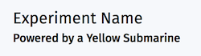


## `order`

The order in which the experiment will appear. Lower numbers appear first. Required.

```yaml
order: 0
```

## `is_featured`

Determines whether the experiment will be featured on the home page.

Featured experiments must include a `video_url` as well.

 Optional.


```yaml
is_featured: false
```

## `description`

A short description of the experiment, used for search engines, social media shares, and in the experiment card. Localized, required, HTML not allowed.

```yaml
description: >
  Lorem ipsum dolor sit amet, consectetur adipisicing elit. Ipsum cum ad deserunt
  iusto possimus. Fugiat odit corrupti cumque.
```

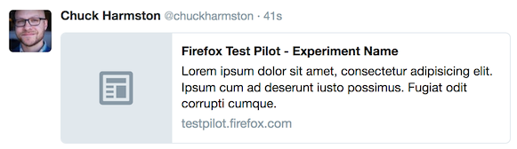

## `platform`

A list of platforms on which this experiment is available - one or more of `addon`, `web`, `ios`, `android`.

When `ios` is included an `ios_url` is also required.
When `android` is included an `android_url` is also required.
When `web` is included a `web_url` is also required.

```yaml
platform: ['addon', 'ios']
```
## `web_url`

If the experiment is on `web` platform, this is the URL to which the details page links.

```yaml
web_url: 'https://example.com/some-web-experiment'
```

## `ios_url`

Url to the iOS app store page for the app. Required when `platform` includes `ios`.

## `android_url`

Url to the Google Play store page for the app. Required when `platform` includes `android`.

## `basket_msg_id`

The message id send to basket for sending mobile app store link to device

## `warning`

A warning message to let users know when an experiment is going to
have conflicts with a specific version.

```yaml
warning: >
  Firefox is changing fast. Tab Center may have bugs in Firefox 55 and
  will be disabled completely in Firefox 56+.
```

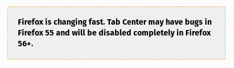

## `introduction`

A short introduction of the experiment, displayed on top of the experiment detail page. Required, localized, HTML required.

```yaml
introduction: >
  <p>Lorem ipsum dolor sit amet.</p>
  <p>Consectetur adipisicing elit.</p>
```

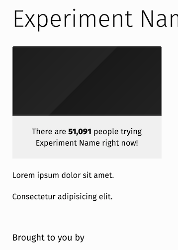

## `news_updates`
An object describing a news update for an experiment. May link to a blog post.

``` yaml
news_updates:
  -
    slug: min-vid-update-1
    title: My Update title
    link: 'https://blog.mozilla.org/testpilot/example'
    created: '2017-06-01T12:00:00Z'
    published: '2017-06-02T12:00:00Z'
    image: 'images/link/to/image.jpg' # optional
    major: true # optional
    dev: false
    content: >
      Example content goes here
```
see also:[General news updates](#general-news-updates)


## `video_url`

If there's a youtube video for the experiment use this field. Note that this should be the embed URL
rather than the sharing url

```yaml
video_url: 'video_url: https://www.youtube.com/embed/lDv68xYHFXM'
```

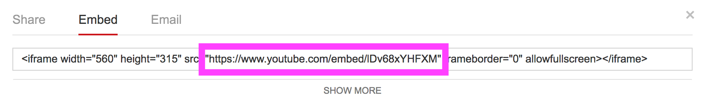

## `image_twitter`

A representative image to be used when being shared on Twitter. Should be a 560x300 JPG. Required.

```yaml
image_twitter: '/static/images/experiments/experiment-name/twitter.jpg'
```

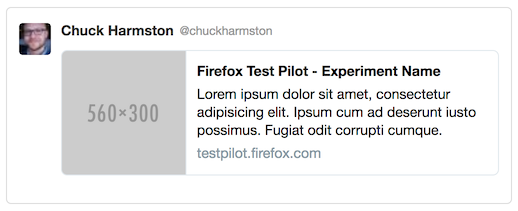


## `image_facebook`

A representative image to be used when being shared on Facebook. Should be a 1200x630 JPG. Required.

```yaml
image_facebook: /static/images/experiments/experiment-name/facebook.jpg
```

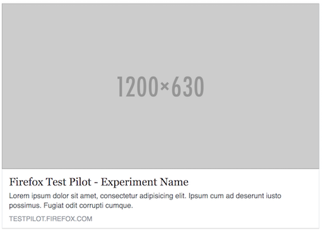


## `thumbnail`

The root absolute path to where the image will be served. Should be a 192x192 PNG with 24-bit transparency, using only white. Required.

```yaml
thumbnail: '/static/images/experiments/experiment-name/thumbnail.png'
```

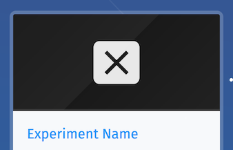


## `gradient_start`

The upper-left color of the gradient displayed in front of the thumbnail image. Required.

```yaml
gradient_start: '#111111'
```


## `gradient_stop`

The bottom-right color of the gradient displayed behind the thumbnail image. Required.

```yaml
gradient_stop: '#222222'
```


## `xpi_url`

The URL to the Test Pilot-hosted XPI file. Required.

```yaml
xpi_url: 'https://testpilot.firefox.com/files/experiment-name/latest'
```


## `addon_id`

The add-on ID from the experiment manifest. Required.

```yaml
addon_id: 'experiment-name@mozilla.com'
```


## `created`

UTM-formatted date indicating the official launch of the experiment. Used to calculate labels like "Just launched". Required.

```yaml
created: '2016-01-01T00:00:00.000000Z'
```

## `Modified`

UTM-formatted date indicating the last major modification to your experiment. This adds a star to your experiment's card.

```yaml
modified: '2016-01-01T00:00:00.000000Z'
```

## `completed`

UTM-formatted date indicating the time the experiment will be retired. Used to calculate labels like "Ending Soon". Optional. Note: should include timezone to ensure experiment completes at the same time everywhere.

```yaml
completed: '2016-01-01T00:00:00.000000Z'
```

## `uninstalled`

UTM-formatted date indicating the time the experiment will be automatically uninstalled.

```yaml
uninstalled: '2016-01-01T00:00:00.000000Z'
```

## `launch_date`

UTM-formatted date indicating the time at which the experiment should be displayed in production. Use this to time experiment launches with marketing campaigns. Optional.

```yaml
launch_date: '2016-01-01T00:00:00.000000Z'
```


## `changelog_url`

The URL to the experiment's changelog. Displayed in the sidebar. Required.

```yaml
changelog_url: 'https://www.github.com/mozilla/experiment-name/blob/master/docs/changelog.md'
```

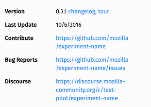


## `contribute_url`

The URL to the code repository for the experiment. Displayed in the sidebar. Required.

```yaml
contribute_url: 'https://www.github.com/mozilla/experiment-name'
```


## `bug_report_url`

The URL to the experiment's issue tracker. Displayed in the sidebar. Required.

```yaml
bug_report_url: 'https://www.github.com/mozilla/experiment-name/issues'
```


## `discourse_url`

The URL to the experiment's Discourse forum. Displayed in the sidebar. Required.

```yaml
discourse_url: 'https://discourse.mozilla-community.org/c/test-pilot/experiment-name'
```


## `privacy_notice_url`

The URL to the experiment's metrics documentation. Displayed beneath the measurement disclaimer. Required.

```yaml
privacy_notice_url: 'https://www.github.com/mozilla/experiment-name/blob/master/docs/metrics.md'
```

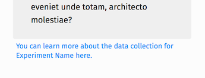


## `details`

An array of one or more image + caption pairs, listed on the experiment detail page. Each one should contain:

- `headline` - Bold text to display at the beginning of the caption. Optional, HTML not allowed.
- `image` - The URL to the image. Should be 1280px wide and 720-1080px tall. Required.
- `copy` - A caption for the image. Localized, required, HTML not allowed.

```yaml
details:
  -
    headline: 'Lorem ipsum'
    image: /static/images/experiments/experiment-name/details-1.jpg
    copy: >
      dolor sit amet, consectetur adipisicing elit. Ipsum cum ad deserunt
      iusto possimus. Fugiat odit corrupti cumq ue.
```

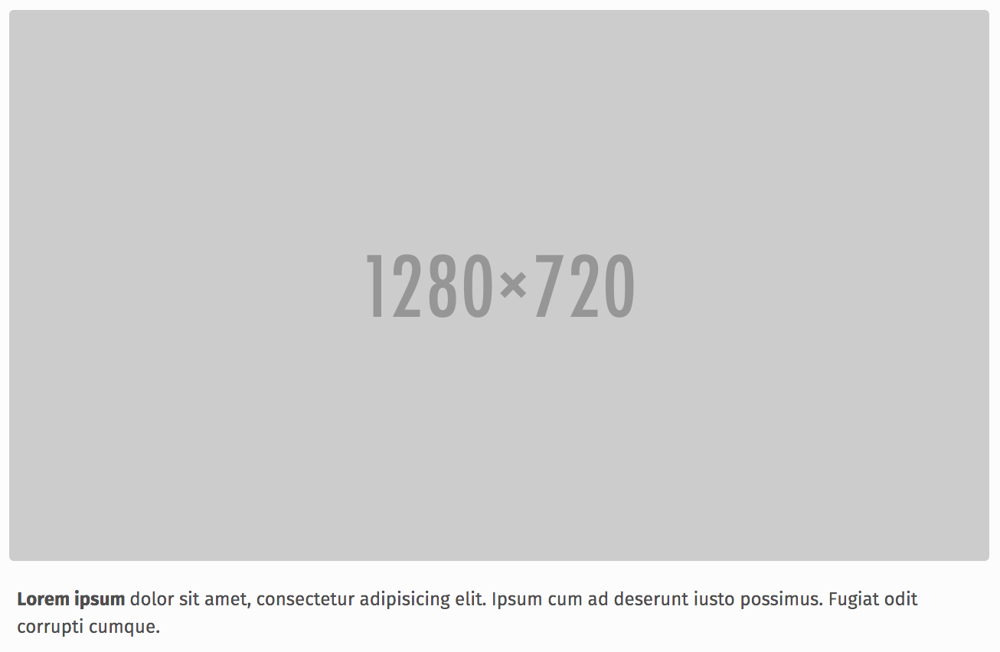


## `contributors`

An array of one or more contributors to the experiment, listed on the experiment detail page. Each one should contain:

- `display_name` - The contributor's name. Required.
- `title` - The contributor's title. Localized, optional.
- `avatar` - The URL to an avatar for the contributor. Should be 64x64. Required.

```yaml
contributors:
  -
    display_name: 'Tom Pizza'
    title: 'Taco Engineer'
    avatar: /static/images/experiments/experiment-name/burrito.png
```


## `contributors_extra`

If your experiment non-enumerable legacy contributions, use this field to call them out. Optional. Localized.

```yaml
contributors_extra: >
    This experiment is based on Firefox Tracking Protection technology built by Mozilla employees
    and contributors over the past several years.
```
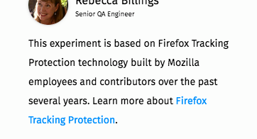

## `contributors_extra_url`

If your experiment contains a `contributors_extra` section, you can optionally pass in a URL for a **learn more** link.

```yaml
contributors_extra: 'https://example.com'
```

## `tour_steps`

An array of one or more steps to a tour presented to users after instsalling the experiment. Each one should contain:

- `image` - The URL to an image. Should be 1280x720. Required.
- `copy` - A caption for the image. Should be wrapped in `<p>` tags. Localized, required, HTML allowed.

```yaml
tour_steps:
  -
    image: /static/images/experiments/experiment-name/tour-1.jpg
    copy: >
      <p>Lorem ipsum dolor sit amet.</p>
```

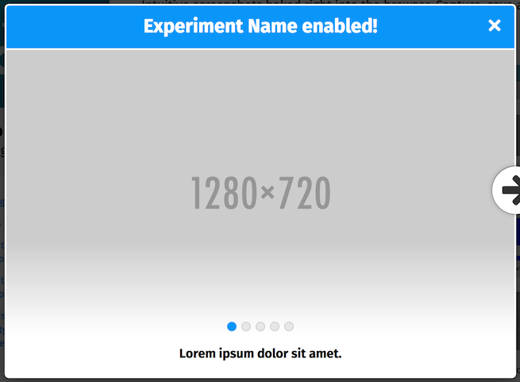


## `measurements`

A description of the measurements collected by the experiment. Displayed in the sidebar in an unordered list. Localized, required, HTML allowed.

```yaml
measurements:
  - >
    Lorem ipsum dolor sit amet, consectetur adipisicing elit. Quibusdam atque accusamus,
    suscipit, nam commodi excepturi error modi. Laborum eum, quae, alias facere,
    cupiditate vitae praesentium eveniet unde totam, architecto molestiae?
  - >
    Lorem ipsum dolor sit amet, consectetur adipisicing elit. Quibusdam atque accusamus,
    suscipit, nam commodi excepturi error modi. Laborum eum, quae, alias facere,
    cupiditate vitae praesentium eveniet unde totam, architecto molestiae?
```


## `pre_feedback_image`

If the experiment collects feedback directly, a modal window similar to the experiment tour is shown before the user goes to the feedback form. This is the image shown when that happens.

Should be 1280x720. Optional, required if `pre_feedback_copy` is set.

```yaml
pre_feedback_image: /static/images/experiments/experiment-name/pre-feedback.jpg
```

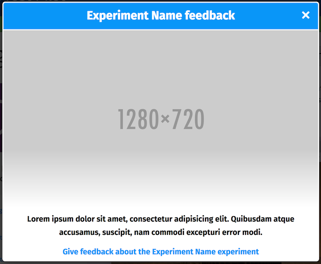


## `pre_feedback_copy`

If the experiment collects feedback directly, a modal window similar to the experiment tour is shown before the user goes to the feedback form. This is the caption of the image in that prompt.

Should be wrapped in `<p>` tags. Localized, optional, required if `pre_feedback_image` is set, HTML allowed.

```yaml
pre_feedback_copy: >
  <p>Lorem ipsum dolor sit amet, consectetur adipisicing elit. Quibusdam atque accusamus,
    suscipit, nam commodi excepturi error modi.</p>
```


## `graduation_url`

When an experiment graduates, a link to the provided graduation_url will be shown on the experiment details page.

If an experiment has graduated but no graduation_url is provided, a message is shown stating that a graduation report is coming soon.

```yaml
graduation_url: http://example.com/graduation-report
```

## `eol_warning`

When your experiement is ending, add this field to idicate to users what will happen next.

Localized, required when you add a `completed` field.

```yaml
eol_warning: 'Lorem ipsum dolor sit amet, consectetur adipisicing elit.'
```

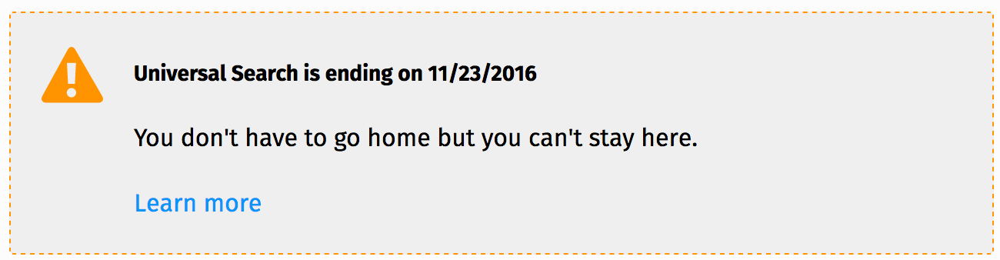

## `min_release`

The minimum version of Firefox with which this experiment is compatible. If the user is browsing with a version lower than this number, an incompatibility notice is displayed. Optional.

```yaml
min_release: 99
```
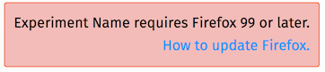

## `max_release`

The maximum version of Firefox with which this experiment is compatible. If the user is browsing with a version higher than this number, an incompatibility notice is displayed. Optional.

```yaml
max_release: 2084
```

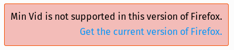


## `incompatible`

A hash of add-ons incompatible with the experiment, mapping add-on ID to its name. If the user has one of these installed and enabled, a warning is displayed to them. Optional.

```yaml
incompatible:
  '@fake-incompatible': 'Fake Incompatible Add-on Name'
```

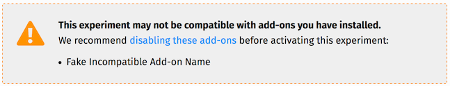


## `locales`

An array of locales without region codes in which the experiment is localized. If defined and the user's first language preference is not in this list, a warning is displayed. Optional.

```yaml
locales:
  - 'en'
```

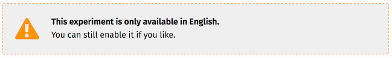


## `locale_blocklist`

An array of locales without region codes from which the experiment should be hidden. If defined and the user's first language preference is not in this list, the experiment will be hidden on the site. Optional.

```yaml
locale_blocklist:
  - 'de'
```


## `locale_grantlist`

An array of locales without region codes in which the experiment should be allowed. If defined and the user's first language preference is in the list, the experiment will be available on the site. Optional.

```yaml
locale_grantlist:
  - 'de'
```


## `dev`

A boolean indicating whether this experiment should only appear in a dev environment, i.e. for testing or active development. Required.

```yaml
dev: false
```

*Note: experiments set to `dev: true` are intentionally skipped during localization string export.*

## `testpilot_options`

A set of options for configuring testpilot features for this experiment.

Enabling / disabling the rating feedback prompt is the only option right now. Valid values are `enabled` or `disabled`. Defaults to `enabled`.

```yaml
testpilot_options:
  ratings: enabled
```

# `General News Updates`
General news updates about testpilot can be added in `content/news_updates.yaml`.
These will show up on the `/experiments` page in reverse chronilogical order along with
the experiment updates.

``` yaml
# News updates for Test Pilot in general expressed as a YAML list
 -
   slug: general-update-1
   title: Example title
   link: https://blog.mozilla.org/testpilot/example
   created: '2017-06-01T12:00:00Z'
   published: '2017-06-02T12:00:00Z'
   image: 'images/link/to/image.jpg' # optional
   major: true # optional
   content: >
     Example content goes here
```


