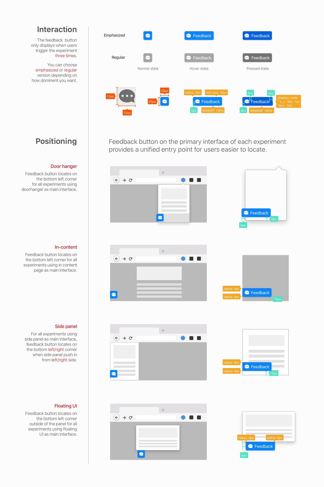

# Test Pilot Experiment Surveys

Each experiment in Test Pilot should include a link to a survey soliciting feedback about things like user satisfaction, bugs and feature requests.

The Test Pilot team is happy to build these surveys for you, but it's a good idea for at least one member on your team to have SurveyGizmo credentials in order to help manage feedback as your experiment is running. Tyler Downer handles SurveyGizmo registrations and can be reach at [tdowner@mozilla.com](mailto:tdowner@mozilla.com).

## Building Your Survey
A member of the Test Pilot team will help provide a Survey URL for integration with your experiment.

Generally the Test Pilot team should build your experiment's survey. If you are familiar with SurveyGizmo and wish to build your own survey, you may do so, but it must be reviewed and approved by the Test Pilot team prior to launch.

Consider copying a recent experiment survey (such as Notes or Send) and using that as a template rather than. The format/organization of these surveys are based on prior user research.

### Survey Logic

SurveyGizmo supports different survey logic based on query params added by the referrer. Each of the three endpoints above use different params so that survey authors can modify surveys accordingly.

Test Pilot has three survey entry points:
1. `ref='disable' From Test Pilot when a user leaves an experiment
2. `ref=givefeedback' From Test Pilot with an enabled experiment
3. `ref=experiment` From the experiment UI

### Survey Theming

Please apply the Test Pilot theme to your survey UI. This can be done from SurveyGizmo's survey builder tool, by selecting the `Test Pilot Survey` theme from `Your Theme Library`.

## Experiment Feedback Integration

All Test Pilot experiments should include feedback buttons within the experiment UI. Your feedback button should have the following properties at a minimum:

- [ ] It should link to your experiment's survey with a query string of `ref=experiment` included in the URL. This parameter will help us filter results that come directly from the experiment for later analysis.
- [ ] It should include a title attribute [tooltip] that indicates the link is for feedback.
- [ ] It should use the [provided icons](../img/feedback).

While not required, we encourage you to integrate your feedback button based on the following spec. There may be cases where the recommended spec would interfere with experiment functionality (see the Notes experiment). If you deviate from spec, please consult with the Test Pilot team prior to experiment launch.

