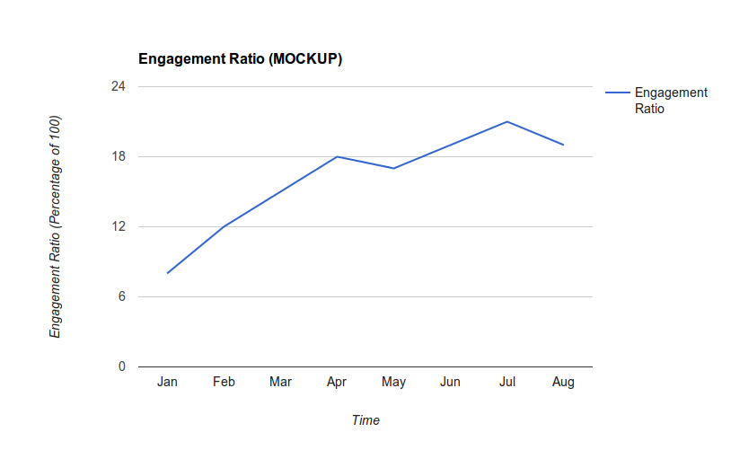

[👈 Back to README](../../README.md)

# 2016 Test Pilot KPIs

In 2016, Test Pilot's success will be defined by building a community which
actively participates in testing ideas in Firefox.  Key metrics are documented
below, however other metrics are recorded and analyzed.


## Engagement Ratio

As of this writing, Mozilla has not settled on a final formula for calculating
an Engagement Ratio, so we'll calculate our ratio based off of [what is
currently being discussed][2] and change it in the future if needed.  Quoting
from that discussion:

> Definition of DAU(day): calculate the total number of active users for that
> date using main_ping.subsessiondate == `day`. Because of data lag, this
> calculation will not be final until 10 days after `day`.
>
> Definition of MAU(day): calculate the total number of active users over a
> 28-day window `day` - 28 < main_ping.subsessiondate <= `day.
>
> On the final dashboard, for each date `E`, display the following calculation:
> `MEAN(DAU(d) for E - 7 < d <= E) / MAU(E)`

A daily active user will be defined as any user, using their browser that day,
with at least one experiment currently enabled in their browser.  This means only
having the Test Pilot extension installed will *not* count as an active user.




## Engagement Breakdown

Within the above Engagement Ratio of a user having at least one experiment
enabled, it is interesting to see how many users have how many experiments
enabled, including the negative space of users with Test Pilot installed but
with no experiments enabled.

Total Users here is defined as a Participating User: a user with the Test Pilot
add-on installed and has run Firefox that day.  They may or may not have any
experiments enabled.

Below is a mockup of what that could look like.


## Service Health

Test Pilot has two critical functions:  firstly to be the broker enabling and
disabling experiments, and secondly, to collect user feedback.  Our main system
health measures will be the number of experiments installed over time and the
count of user feedback recorded over time.  These will allow us to quickly see
disruptions in service regardless of cause.


## Data Collection Details

There are two sources for metrics data - the server and the client.


### Server-side events

**The server** will use server logs to store metric data which will be picked
up by the measurement team ([some docs][3]), parsed and transformed if
necessary, and pushed into ElasticSearch (as scale permits), S3, and Redshift.
Events recorded in the logs will include:

* request.summary (a generic event fired for each visit)
* testpilot.newuser
* testpilot.test-install

Data recorded by the log files will include standard system logging (in the
example below, this is everything down to the blank line in the Fields object)
as well as:
* Feature Switch Set (if applicable)
* Campaign (marketing identifier) (if applicable)

Using the [standard format][4] an example object will look like:

```js
{
  "Timestamp": 1457462527,
  "Type": "testpilot.test-install",
  "Logger": "TestPilotWeb",
  "Hostname": "testpilot.servers.s3",
  "EnvVersion": "2.0",  // We're conforming to the Fields spec
  "Severity": 0,
  "Pid": 1000,
  "Fields":{
    "agent": "User Agent String",
    "path": "/tests/",
    "method": "GET",
    "code": 200,
    "errno": 0,
    "lang": "en-US",
    "uid": 1000,  // This is the Test Pilot UID
    "service": "universal_search@mozilla",  // If the ping comes from an experiment within the program, the identifier goes here
    "context": "",
    "msg": "New Test Installed: Universal Search",
    "remoteAddressChain": ["1.2.3.4", "4.3.2.1"],
    "rid": "0b65c6fb-26d5-4367-be29-b3094f0c69d5",
    "t": 256,

    "feature_switches": "",
    "campaign": ""
  }
}
```

and the schema we'll be using in RedShift will omit a couple of fields:

```js
local schema = {
--   column name                   field type   length  attributes   field name
    {"timestamp",                  "TIMESTAMP", nil,    "SORTKEY",   "Timestamp"},
    {"uuid",                       "VARCHAR",   36,      nil,         get_uuid},
    {"type",                       "VARCHAR",   255,     nil,         "Type"},
    {"logger",                     "VARCHAR",   255,     nil,         "Logger"},
    {"hostname",                   "VARCHAR",   255,     nil,         "Hostname"},
    {"severity",                   "INTEGER",   nil,     nil,         "Severity"},

    -- Parsed automatically from the `agent` field
    {"user_agent_browser",         "VARCHAR",   255,     nil,         "Fields[user_agent_browser]"},
    {"user_agent_os",              "VARCHAR",   255,     nil,         "Fields[user_agent_os]"},
    {"user_agent_version",         "VARCHAR",   255,     nil,         "Fields[user_agent_version]"},

    {"path",                       "VARCHAR",   56,      nil,         "Fields[path]"},
    {"method",                     "VARCHAR",   200,     nil,         "Fields[method]"},
    {"code",                       "VARCHAR",   255,     nil,         "Fields[code]"},
    {"errno",                      "VARCHAR",   255,     nil,         "Fields[errno]"},
    {"lang",                       "VARCHAR",   36,      nil,         "Fields[lang]"},
    {"uid",                        "INTEGER",   nil,     nil,         "Fields[uid]"},
    {"service",                    "VARCHAR",   255,     nil,         "Fields[service]"},
    {"context",                    "VARCHAR",   255,     nil,         "Fields[context]"},
    {"msg",                        "VARCHAR",   1000,    nil,         "Fields[msg]"},
    {"remoteAddressChain",         "VARCHAR",   255,     nil,         "Fields[remoteAddressChain]"},
    {"rid",                        "VARCHAR",   255,     nil,         "Fields[rid]"},
    {"t",                          "VARCHAR",   36,      nil,         "Fields[t]"},
    {"feature_switches",           "VARCHAR",   255,     nil,         "Fields[feature_switches]"},
    {"campaign",                   "VARCHAR",   255,     nil,         "Fields[campaign]"}
}
```

### Client-side Telemetry

The second source, **the client**, will use the existing Telemetry system (the
system we use for measuring all kinds of things in Firefox, [see examples][5])
which has a [submitExternalPing() function][6].  This function will allow us to
submit arbitrary payloads to the Telemetry pipeline which are then scrubbed and
put into an appropriate Redshift cluster with all our server log data.  The
client pings will adhere to the [common ping format][7], will include the
clientId and [environment][8].  There will be two Telemetry ping types,
`testpilot` and `testpilottest`.

#### `testpilot` summary ping

The `testpilot` ping type is an event-driven ping (meaning, it fires when an
event happens).  The format allows for batching of events submitted
periodically but currently pings are sent for every event.  The `testpilot`
payload consists of:

* a timestamp of when the ping is submitted in seconds since the browser was
  started
* a test name set to the `em:id` of the add-on with the event.  For Test Pilot
  that is `@testpilot-addon`.
* an `events` array with each object consisting of:
  * a timestamp of when the event happened in seconds since the browser was
    started
  * a string field called `object` which is what the event is affecting (for
    example, "toolbar_button_1")
  * a string field called "event" which is what happened.  Examples include
    include: activate, click, install

An example payload (within the full ping) would look like:
```js
{
  "timestamp": 1500,
  "test": "@testpilot-addon", // The em:id field from the add-on
  "version": "1.2-beta2",     // The version field from the add-on
  "events": [
    {
      "timestamp": 1100,
      "object": "toolbar_button_1",
      "event": "clicked"
    }
  ]
}
```

#### Per-experiment `testpilottest` ping

The `testpilottest` type has a light wrapper around a second payload which is
defined by each individual experiment.  The second payload's schema will be
defined by each experiment and needs to remain flexible for rapid changes.
We suggest each experiment send pings in an event-driven model (meaning, ping
for each event).  However, the Test Pilot add-on reserves the ability to batch
events and submit them periodically.

The `testpilottest` ping type consists of the following fields:

* The experiment ID (the `em:id` field of the add-on)
* The version of the experiment (the `version` field of the add-on)
* A timestamp of when the event happened in seconds since the browser was
  started
* A variants object with details of any [variants](experiments/variants.md) which are running
* The data payload

An example ping would look like:
```js
{
 "test": "universalsearch@mozilla",  // The em:id field from the add-on
 "version": "1.2-testing",  // The version field from the add-on
 "timestamp": 1299,
 "variants": '{"someTest": "b", "someOtherTest: true}',
 "payload": { ... }
}
```

**Please note that each experiment will need to define its payload schema before
being able to record data.**

[Example add-ons][9] are available to look at the code when writing your own
add-ons.

To ensure that the client can submit data the Test Pilot add-on will require
that the Basic Telemetry system is enabled (which is on by default in Firefox).

In addition to the above, we will also instrument the site with Google
Analytics to collect standard browsing behavior, analytics information, and
funnel tracking.

All data is kept, by default, for 180 days.

[1]: https://wiki.mozilla.org/Test_Pilot/Metrics
[2]: https://bugzilla.mozilla.org/show_bug.cgi?id=1240849
[3]: https://mana.mozilla.org/wiki/display/SVCOPS/Telemetry+-+Data+Pipeline+Architecture
[4]: https://mana.mozilla.org/wiki/display/CLOUDSERVICES/Logging+Standard
[5]: https://telemetry.mozilla.org/
[6]: https://dxr.mozilla.org/mozilla-central/source/toolkit/components/telemetry/TelemetryController.jsm#192
[7]: https://gecko.readthedocs.org/en/latest/toolkit/components/telemetry/telemetry/common-ping.html
[8]: https://gecko.readthedocs.org/en/latest/toolkit/components/telemetry/telemetry/environment.html
[9]: https://github.com/mozilla/testpilot/tree/master/docs/examples
